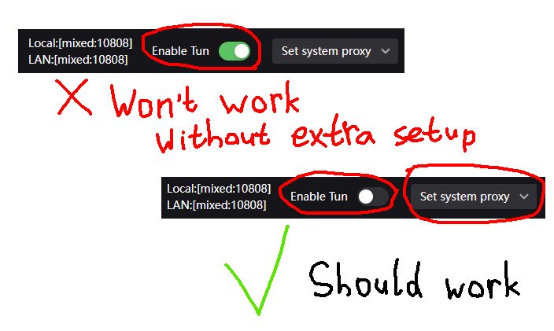

<!-- markdownlint-disable MD033 MD045 -->

# NutPunch


> [!CAUTION]
> NutPunch implements **UDP-based peer-to-peer networking**. **Client-server architecture** is a lot more commonplace in games, and arguably much easier to implement and understand. Use NutPunch only if you know what you're getting yourself into. You have been warned.

NutPunch is a header-only UDP hole-punching library, written in plain C. Dependency-free and brutal.

Comes with a [public instance](#public-instance) for out-of-the-box integration.

:heavy_check_mark: [Schwungus](https://github.com/Schwungus)-certified.

## Troubleshooting

> [!NOTE]
> For simplicity's sake, NutPunch does not implement [TURN](https://en.wikipedia.org/wiki/Traversal_Using_Relays_around_NAT) at the moment.

If you're having **connectivity issues in a game powered by NutPunch**, please make sure **there is a direct route to your computer** from the public network. That means, even if you're on a hotel Wi-Fi network in rural Turkmenistan, NutPunch should still work, as long as you **aren't masking your outbound IP address system-wide**. Using a proxy service for accessing the Web shouldn't interfere as long as **you aren't routing your whole traffic in TUN mode** or something similar.

Here's a short infographic for troubleshooting connectivity with [v2rayN](https://github.com/2dust/v2rayN) and similar proxy clients:



## Introductory Lecture

This library implements P2P networking, where **each peer communicates with all others**. It's a complex model, and it could be counterproductive to use if you don't know what you're signing yourself up for. If you don't feel like reading the immediately following blanket of words and scribbles, you may skip to [using premade integrations](#premade-integrations).

Before you can punch any holes in your peers' NAT, you will need a hole-punching server **with a public IP address** assigned. Querying a public server lets us bust a gateway open to the global network, all while the server relays the connection info for other peers to us. If you're just testing, you can use [our public instance](#public-instance) instead of [hosting your own](#hosting-your-own-nutpuncher). The current server implementation uses a lobby-based approach, where each lobby supports up to 8 peers and is identified by a unique ASCII string.

In order to run your own hole-puncher server, you'll need to get the server binary from our [reference implementation releases](https://github.com/Schwungus/nutpunch/releases/tag/rolling). If you're in a pinch, don't have access to a public IP address, and your players reside on a LAN/virtual network such as [Radmin VPN](https://www.radmin-vpn.com), you can actually run NutPuncher locally and use your LAN IP address to connect to it.

Once you've figured out how the players are to connect to your hole-puncher server, you can start coding up your game. [The complete example](src/Test.c) might be overwhelming at first, but make sure to skim through it before you do any heavy networking. Here's the general usage guide for the NutPunch library:

1. At the start of the program, set your game ID using `NutPunch_SetGameId("game-id")`.
2. Host a lobby with `NutPunch_Host("lobby-name")`, or join an existing one with `NutPunch_Join("lobby-name")`.
3. Listen for events:
    1. Call `NutPunch_Update()` each frame. This will also automatically send lobby and peer metadata back and forth to the NutPuncher server.
    2. Check your status by matching the returned value against `NPS_*` constants. `NPS_Online` is what you're looking for normally, but make sure to handle `NPS_Error`. To get a human-readable error description, call `NutPunch_GetLastError()`.
4. Run the game logic.
5. Keep in sync with the peers:
    1. Send messages with `NutPunch_Send()` or `NutPunch_SendReliably()` (for reliable delivery).
    2. Poll for incoming messages with `NutPunch_HasMessage()` and retrieve them with `NutPunch_NextMessage()`.
    3. Set/retrieve lobby or peer metadata with `NutPunch_Set*Data()`/`NutPunch_Get*Data()`.
6. Repeat steps 3 through 5 throughout the networking session.
7. Use `NutPunch_Disconnect()` to leave the lobby, or `NutPunch_Shutdown()` at the end of your program to do final clean-up. You're all set!

An important aspect of NutPunch networking is the ability to set lobby/peer metadata in a simplified key-value-store fashion. Peer metadata can include e.g. the peer's username, their character - anything you can squeeze into a 32-byte null-terminated string, mapped to 16-byte null-terminated string key. The same applies to lobby metadata: this could be the name of the level to play on, the difficulty level, rules to alter the game's behavior, etc.

For the lobby and each peer, the current limit to how many fields they can hold is 8.

Call `NutPunch_Set*Data(...)`/`NutPunch_Get*Data(...)` to set/get key-value pairs; replace the asterisk with either `Peer` or `Lobby`. Setting metadata only does anything if you're "in charge" of the metadata object: either you're the lobby's master and want to set the lobby's metadata, or you're trying to set your own metadata as a peer.

## Premade Integrations

None yet.

> **TODO**: Add a [GekkoNet](https://github.com/HeatXD/GekkoNet) network adapter implementation.

## Installation

If you're using CMake, you can include this library in your project by adding the following to your `CMakeLists.txt`:

```cmake
include(FetchContent)
FetchContent_Declare(NutPunch
    GIT_REPOSITORY https://github.com/Schwungus/nutpunch.git
    GIT_TAG stable) # you can use a specific commit hash here
FetchContent_MakeAvailable(NutPunch)

add_executable(MyGame main.c) # your game's CMake target goes here
target_link_libraries(MyGame PRIVATE NutPunch)
```

For other build systems (or lack thereof), you only need to copy [`NutPunch.h`](include/NutPunch.h) into your include path. Make sure to link against `ws2_32` on Windows though, or else you'll end up with scary linker errors related to Winsock.

## Basic Usage

Once [`NutPunch.h`](include/NutPunch.h) is in your include-path, using it is straightforward, just like any header-only library. Select a source file where the library's function definitions will reside (it could be your `main.c` as well), tell the compiler to add NutPunch implementation details with a `#define NUTPUNCH_IMPLEMENTATION`, and `#include` the library's main header inside it:

```c
#include <stdlib.h> // for EXIT_SUCCESS

#define NUTPUNCH_IMPLEMENTATION
#include <NutPunch.h>

int main(int argc, char* argv[]) {
    (void)argc, (void)argv;

    NutPunch_SetGameId("My Cool Game");
    NutPunch_Join("My Lobby");

    for (;;) { // your game's mainloop goes here...
        NutPunch_Update();
        Sleep(1000 / 60);
    }

    NutPunch_Shutdown();
    return EXIT_SUCCESS;
}
```

If you want to see all the juicy APIs in action, read up on [`Test.c`](src/Test.c) from this repo. For a general overview of available functionality, just read the doc-comments for the functions around the middle of [`NutPunch.h`](include/NutPunch.h). Also take a look at [the advanced usage section](#advanced-usage) to discover things you can customize.

## Public Instance

If you don't feel like [hosting your own instance](#hosting-your-own-nutpuncher), you may use our public instance. It's used by default unless a different server is specified.

If you want to be explicit about using the public instance, call `NutPunch_SetServerAddr`:

```c
NutPunch_SetServerAddr(NUTPUNCH_DEFAULT_SERVER);
NutPunch_Join("lobby-id");
```

## Advanced Usage

### Customize Memory Handling

You can `#define` custom memory handling functions for NutPunch to use, before including the header. They're only relevant to the implementation. If none are specified, C's standard library functions are used.

SDL3 example:

```c
#include <SDL3/SDL_stdinc.h>

#define NUTPUNCH_IMPLEMENTATION
#define NUTPUNCH_NOSTD

#define NutPunch_SNPrintF SDL_snprintf
#define NutPunch_StrNCmp SDL_strncmp
#define NutPunch_StrNLen SDL_strnlen
#define NutPunch_Memcmp SDL_memcmp
#define NutPunch_Memset SDL_memset
#define NutPunch_Memcpy SDL_memcpy
#define NutPunch_Malloc SDL_malloc
#define NutPunch_Free SDL_free
#define NutPunch_TimeNS SDL_GetTicksNS

#include <NutPunch.h>
```

### Customize Logger Implementation

Just like in the example above, you can override NutPunch's logging facility before including `NutPunch.h`:

```c
#include <stdio.h>

// override with a simplified version of the default logger:
#define NutPunch_Log(msg, ...) printf(msg "\n", ##__VA_ARGS__)

#define NUTPUNCH_IMPLEMENTATION
#include <NutPunch.h>
```

## Hosting your own NutPuncher

If you're dissatisfied with [the public instance](#public-instance), whether from needing to stick to a specific build or fork or whatever, you can host your own. Make sure to read [the introductory pamphlet](#introductory-lecture) before attempting this.

**TODO**: document how to build a NutPuncher yourself.
